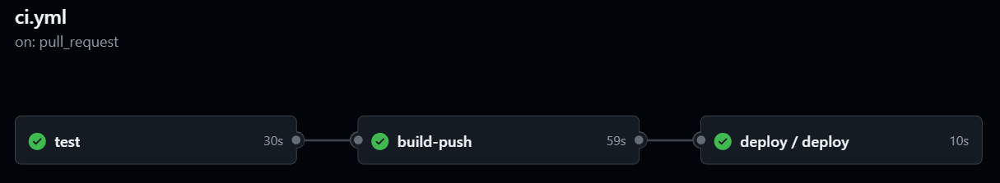

# CI/CD Pipelines

## Overview
The CI/CD pipeline automates the process of building, testing, and deploying the application using **GitHub Actions**. It consists of three workflows:
1. **Testing (`ci.yml`)**:
   - Triggers on pushes to the `actions` branch and pull requests to `main`.
   - Runs tests.

2. **CI Workflow (`ci.yml`)**: 
   - Builds a Docker image from the `Api/Dockerfile`.
   - Pushes the Docker image to AWS ECR, tagging it with the commit hash.
   - Passes the image tag to the deployment pipeline.

3. **CD Workflow (`cd.yml`)**:
   - Called by the CI pipeline after a successful build and push.
   - Runs on an EC2 instance via SSH.
   - Pulls the latest Docker image from ECR.
   - Stops and removes the previous container.
   - Deploys the new image as a running container.

   

## Secrets and Security
- AWS credentials and repository details are stored as GitHub secrets.
- The EC2 server's SSH credentials are securely stored and accessed only during deployment.

## Reasoning
### Why GitHub Actions?
- **Cloud Advantages**: No need to manage CI/CD infrastructure.
- **Seamless Secret Management**: Integrates easily with GitHub Secrets.
- **Simplicity & Integration**: Works natively with GitHub repositories.

### Why Two Pipelines?
- **Separation of Concerns**: CI (build, test, push) and CD (deploy) are handled separately.
- **Better Modularity**: Allows independent improvements and debugging of CI/CD stages.

## Secrets and Security
- AWS credentials and repository details are stored as GitHub secrets.
- The EC2 server's SSH credentials are securely stored and accessed only during deployment.

## Future Improvements
- Implement automated testing in the CI pipeline.
- Add monitoring and alerting for deployment failures.
- Improve rollback strategies in case of failed deployments.
