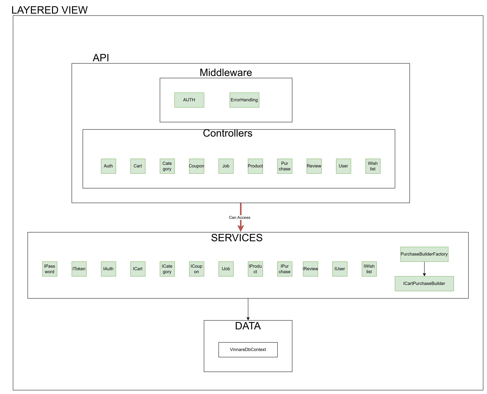

# Code Structure

## Overview
Vinnare follows an N-Tier architecture, dividing the code into multiple layers to ensure separation of concerns, maintainability, and scalability. The system architecture is illustrated in the diagram below:

## Layer Responsibilities

- **Api Layer**
  - Acts as the entry point for requests.
  - Contains controllers to handle API endpoints.
  - Manages middleware and dependency injection setup.
  - Implements business logic within controllers before delegating to services.

- **Services Layer**
  - Implements core business logic.
  - Services interact with the database via `VinnareDbContext`.
  - Controllers call services through dependency injection.

- **Data Layer**
  - Manages database access using Entity Framework Core.
  - Defines entities and database migrations.

- **Shared Layer**
  - Contains globally used components such as DTOs, enums, configurations, and exceptions.
  
## Inter-layer Communication
- All communication between layers happens through **system calls and dependency injection**.
- Controllers can call multiple services as needed to process a request.
- The API layer does not interact directly with the database—only services access `VinnareDbContext`.

## Code Organization and Conventions

- **Naming Conventions**
  - **Controllers:** Named with `Controller` suffix (e.g., `UserController.cs`).
  - **Services:** Named with `Service` suffix (e.g., `UserService.cs`).
  - **Tests:** Follow the format `{ClassName}_test.cs` (e.g., `UserService_test.cs`).

This structured approach ensures clarity, consistency, and ease of maintenance across the project.