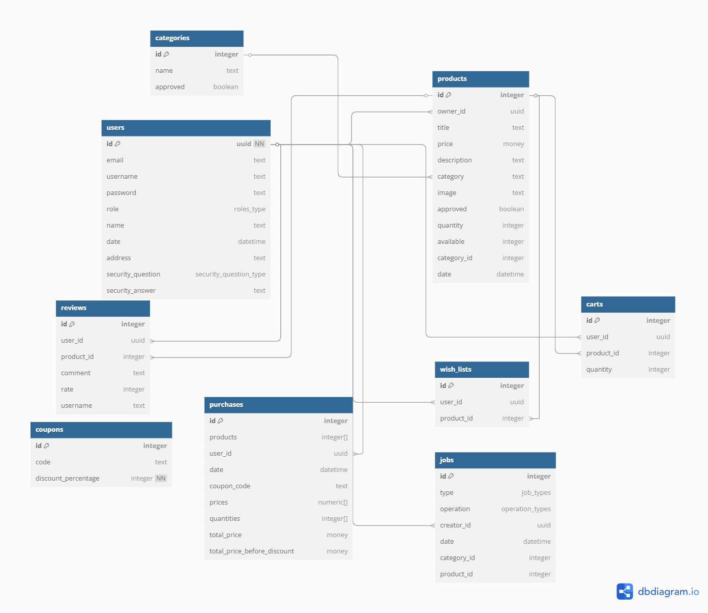

# Database Structure

## Overview
Vinnare uses **PostgreSQL** as its relational database, managed through **Entity Framework Core**. The database consists of multiple entities representing users, products, categories, purchases, and related eCommerce operations.

The database schema is visually represented in the following diagram:

## Entities and Relationships

- **User**
    
    - Stores user details like `Email` and `Username`, both uniquely indexed.
        
    - Can own products, write reviews, manage wishlists and carts, make purchases, and initiate jobs (approval requests).
        
- **Product**
    
    - Represents an item available for sale.
        
    - Belongs to a **User** (Owner) and a **Category**.
        
    - Requires admin approval (`Approved` defaults to `false`).
        
    - Linked to **Reviews, Wishlists, Carts, and Jobs**.
        
    - Cascade deletes ensure associated data is removed if the product is deleted.
        
- **Category**
    
    - Groups products under defined types.
        
    - Requires admin approval before being listed (`Approved` defaults to `false`).
        
    - Linked to **Products** and **Jobs**.
        
- **Review**
    
    - Created by users to rate and review products.
        
    - Linked to both a **User** and a **Product**.
        
    - Cascade deletes apply when either the user or product is removed.
        
- **WishList**
    
    - Lets users save products for future consideration.
        
    - Uniquely constrained per `(UserId, ProductId)`.
        
    - Cascade deletes apply for both related entities.
        
- **Cart**
    
    - Represents products added by users with intent to buy.
        
    - Also uniquely constrained per `(UserId, ProductId)`.
        
    - Cascade deletes apply similarly as in WishLists.
        
- **Coupon**
    
    - Stores discount codes.
        
    - Each `Code` is uniquely indexed.
        
- **Purchase**
    
    - Represents a completed transaction.
        
    - Linked to a **User** with cascade deletion behavior.
        
- **Job**
    
    - Used in moderation workflows for **Products** and **Categories**.
        
    - Managed by **Admins** and linked to:
        
        - **User** (creator),
            
        - **Product** (optional),
            
        - **Category** (optional).
            
    - All relationships use cascade deletion for cleanup.
        

## Constraints and Rules

- **Unique Constraints**
    
    - `User.Email`
        
    - `User.Username`
        
    - `WishList (UserId, ProductId)`
        
    - `Cart (UserId, ProductId)`
        
    - `Coupon.Code`
        
- **Cascade Deletions**
    
    - Deleting a **User** removes all related **Products, Reviews, WishLists, Carts, Purchases, and Jobs**.
        
    - Deleting a **Product** removes related **Reviews, WishLists, Carts, and Jobs**.
        
    - Deleting a **Category** removes associated **Jobs**.