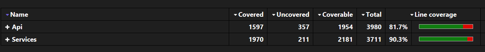

# Testing Strategy

## Overview

Vinnare follows a robust and maintainable testing strategy that prioritizes **clarity**, **coverage**, and **reliability**. We aim for consistent practices across all layers, from controllers to services, with a strong emphasis on isolating logic through mocking and in-memory databases.

> **Current test coverage exceeds 85%**

---

## Testing Principles

### Isolation

Each test runs in isolation without side effects. This is achieved through:

- **Mocking interfaces** like `ITokenService`, `IUserService`, or `ILogger<T>` to focus only on the logic under test.
    
- **In-memory databases** (via `TestDbContextFactory`) for integration-like service tests without external dependencies.
    

### Repeatability

Tests can be run multiple times with consistent results. All state is reset per test through fresh DB context instances and mock setups.

### Expressive Assertions

Each test clearly communicates intent through structured **Arrange-Act-Assert** blocks, using:

- `Assert.IsType<>` to verify response types.
    
- `Assert.Equal`, `Assert.Null`, or `Assert.NotNull` to validate output data.
    
- `Assert.ThrowsAsync<ExceptionType>` to enforce failure expectations.
    

---

## Controller Tests

Controller-level tests validate HTTP logic and error handling using mocked services. Key patterns include:

- **Simulated requests** with DTOs to mirror real-world usage.
    
- **Mocked dependencies** to ensure controller logic is verified independently of service implementations.
    
- **Exception validation**, asserting that proper exceptions are thrown for invalid input or unauthorized access.
    

These ensure that endpoints behave as expected for both success and failure paths.

---

## Service Tests

Service logic is tested using **real EF Core contexts** configured with the `TestDbContextFactory`. This allows us to:

- Verify **CRUD operations** on in-memory data.
    
- Simulate more realistic flows (e.g., cart manipulation, product lookup).
    
- Confirm DB-side behavior like relationships and cascade deletions.
    

Each service test focuses on real usage scenarios and data consistency.

---

## Test Utilities

### `TestDbContextFactory`

```
public static VinnareDbContext Create()
        {
            var options = new DbContextOptionsBuilder<VinnareDbContext>()
                .UseInMemoryDatabase(databaseName: $"TestDb_{Guid.NewGuid()}")
                .Options;

            var context = new VinnareDbContext(options);
            context.Database.EnsureCreated();
            return context;
        }
```

This static utility provides clean, isolated `VinnareDbContext` instances backed by **in-memory databases** with unique names per test run. It ensures:

- No state leakage between tests.
    
- DB behavior remains testable without a real server.
    
- Data setup is fast and reliable.
    

---

## Best Practices

- Keep test files named consistently with the class under test (e.g., `AuthController_test.cs`, `CartService_test.cs`).
    
- Place tests **next to the logic they validate** for improved maintainability.
    
- Mock only what is needed — let EF and data models behave naturally where it adds value.
    
- Avoid over-testing simple mappings or trivial getters/setters.
    
- Focus on **behavior**, not implementation.